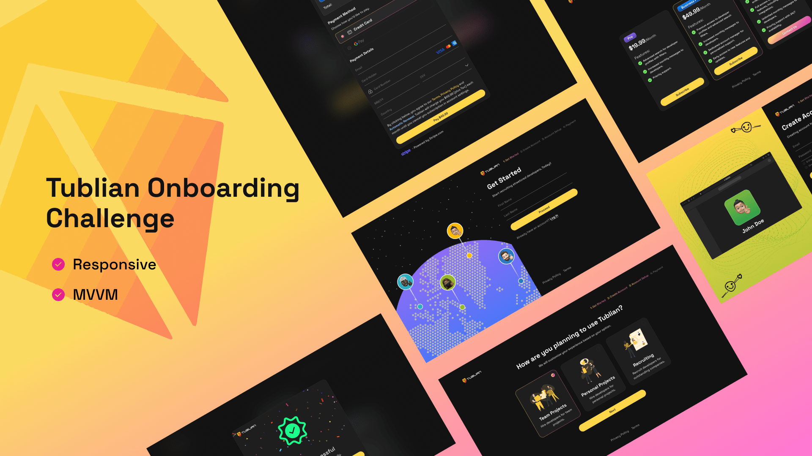

# Tublian Customer Onboarding Application

As a member of the TublianX web development team, I my task was to develop a new customer onboarding application. The team's designer provided the Figma design.

## Table of Contents

- [Requirements](#requirements)
- [Tech Stack](#tech-stack)
- [Run Locally](#run-locally)
  - [Prerequisites](#prerequisites)



## Requirements

- **Tech Stack Selection**: Choose your preferred tech stack. Options include Next.js, Angular, React, among others.
- **Design Pattern**: Your frontend code must adhere to the MVVM (Model, View, ViewModel) pattern.
- **Style Guide**: Use the css properties provided by Figma design.
- **Code Hosting and Open-Sourcing**: Host your project on GitHub and make it open-source.
- **Submission**: Once completed, submit your GitHub repository link.

### Bonus Task:

Integrate the application with Stripe and develop the necessary backend API.

## Tech Stack

| Purpose              | Stack       |
| -------------------- | ----------- |
| **Frontend**         | Angular 16  |
| **Styling**          | TailwindCSS |
| **Deployment**       | Netlify     |
| **Version Control**  | Git, GitHub |

## Run Locally

### Prerequisites

List any prerequisites or dependencies that need to be installed before running the application. For example:

- [Node.js](https://nodejs.org/) (v18.10.0 or higher)
- [npm](https://www.npmjs.com/) (v8.19.4 or higher)
- [Angular 16 cli](https://www.npmjs.com/package/@angular/cli) (`npm install -g @angular/cli@16`)

Clone the project

```bash
  git clone https://github.com/IEdiong/tublian-frontend-challenge.git

  or
  # For SSH
  git clone git@github.com:IEdiong/tublian-frontend-challenge.git
```

Go to the project directory

```bash
  cd tublian-frontend-challenge
```

Install dependencies

```bash
  npm install
```

Start the server

```bash
  npm run start
```
